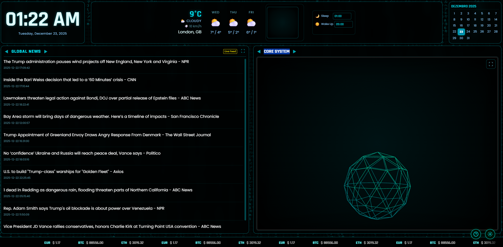

# Operator Panel (Open Source Skeleton)

<div align="center">
  
  <h1>Operator Panel</h1>
  <p>
    <strong>A cyberpunk ambient dashboard for your secondary monitor.</strong>
  </p>
  
  <a href="https://operatorpanel.app/">
    
  </a>

  <h3>
    <a href="https://operatorpanel.app/">🔴 LIVE DASHBOARD</a>
  </h3>
</div>

---

## 🚀 UPDATES (Live App)

New: 🐾 **Pet Models V2:** All original pets have been upgraded with new, detailed models—Llama, Cow, Donkey, Horse, and Shiba Inu now look better than ever!
New: 💾 **Pet Memory:** Your selected pet is now saved! When you return, your favorite companion will be waiting for you.
New: 🏠 **Barn with Clock:** The shelter now features a fully functional wireframe clock on the facade, synchronized with real time!
New: 🌳 **Seasonal Tree Models:** All-new tree models for each season—lush greens for summer, vibrant oranges for autumn, bare branches for winter, and blooming flowers for spring.
💨 **Wind Physics:** Real-time wind simulation! See the wind lines animation, plus rain & snow reacting to actual weather data.
☁️ **Advanced Weather:** A complete overhaul of the cloud system! Now distinguishing between partly cloudy (small cumulus), overcast (dense white), storm (massive nimbus), and more with unique low-poly visuals.
🎅 **Christmas Event:** Keep your eyes peeled on Dec 25th! A certain bearded guest might fly by... hope he watched out for the barn! 🛷✨
🎉 **New Year's Eve:** A custom drone show and firework spectacle is cleared for takeoff! Watch the sky on Dec 31st at 23:59:50. 🎆🚁
📰 **Immersive News:** Click the square icon in the news feed for a transparent, fullscreen Matrix experience! Auto-rotating topics with a dedicated clock. 🕶️

---

## 🕰️ The Living Clock (Live App)

The Operator Panel features a **Living Clock** — a 3D world that reacts to time and weather. Here's how it works:

- **🐾 Hourly Animals:** Every hour, a different animal walks across the scene to mark the time. Stay alert to spot them all!
- **🦋 Half-Hour Insects:** Fireflies and butterflies (more insects coming soon!) appear at the 30-minute mark of each hour, alternating between species.
- **✨ Random Events:** Special animations occur between the 15th and 45th minute of each hour, or at specific times.
- **📅 Golden Calendar Days:** Look for dates marked in gold on the calendar above — they indicate special event days with unique animations (like Christmas and New Year's Eve)!

---

## 💀 Why a Skeleton Version?
This repository contains the **architectural skeleton** of the Operator Panel. 

**Where is the "Living Pet"? Where are the events?**
The full "Live App" experience (available at [operatorpanel.app](https://operatorpanel.app/)) is designed to be full of **surprises, seasonal events, and hidden interactions**. To preserve the magic and prevent "spoilers" for our users, the proprietary assets (3D models, complex event logic, and audio) have been excluded from this open-source release.

Instead, this repo provides:
- The **complete Three.js + Vanilla JS integration**.
- A **reactive "Core" (Wireframe Sphere)** that demonstrates the interaction logic without revealing the characters.
- The full **Weather, News, and Finance** systems.

It serves as a perfect starting point for building your own ambient dashboard while showing how the original was built.

---

## 🔮 The Philosophy (Live App)
The **Operator Panel** was designed as a **low-stimulation, ambient companion** for focus and relaxation.

In a world of constant notifications and demanding interfaces, this dashboard sits quietly on your secondary screen or tablet, providing:
- **Calmness:** Dark, high-contrast aesthetics (inspired by the Matrix and Retro Computing) that don't distract.
- **Connection:** A "Living Clock" that knows the real weather outside your window and reacts to it.
- **Discovery:** A system that feels alive, with rare random events and seasonal changes that reward long-term usage.

---

## 🚀 Features (This Repo)
- **🕰️ Living Clock:** Real-time day/night cycles synchronized with your local weather.
- **☁️ Weather HUD:** Current conditions, forecast, and wind analysis (powered by Open-Meteo).
- **📰 News Feed:** Aggregated headlines from customized topics and countries.
- **💰 Finance Ticker:** Monitor Fiat and Crypto currency rates.
- **📺 Tube Vision:** Integrated YouTube player for background ambiance (requires API Key).
- **🧊 3D Core:** A Three.js interactive scene ready for your custom 3D assets.

## 🛠️ Installation

### Prerequisites
- Node.js (v16+)
- npm

### Setup
1. **Clone the repository:**
   ```bash
   git clone https://github.com/lucasterres/operator-panel-app.git
   cd operator-panel-app
   ```

2. **Install dependencies:**
   ```bash
   npm install
   ```

3. **Run development server:**
   ```bash
   npm run dev
   ```

4. **Build for production:**
   ```bash
   npm run build
   ```

## ⚙️ Configuration
The dashboard is configurable directly via the UI settings panel (Gear icon).
- **Location:** Auto-detects or sets city for weather.
- **YouTube:** Add your own [Google Cloud API Key](https://console.cloud.google.com/) to enable the video player.

## 📄 License
MIT License. Feel free to use and modify for your personal setup.
